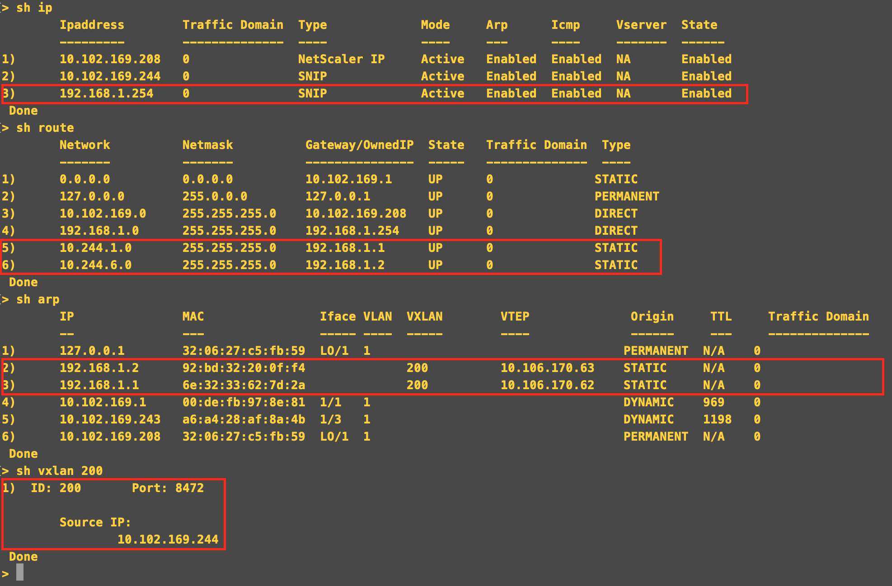

# Deploy the Citrix k8s node controller

  This topic provides information on how to deploy Citrix node controller on Kubernetes and establish the route between Citrix ADC and Kubernetes Nodes.

Perform the following:

1.  Download the `citrix-k8s-node-controller.yaml` deployment file using the following command:

    ```
	wget https://raw.githubusercontent.com/citrix/citrix-k8s-node-controller/master/deploy/citrix-k8s-node-controller.yaml
    ```

    The deployment file contains definitions for the following:

    -  Cluster Role (`ClusterRole`)

    -  Cluster Role Bindings (`ClusterRoleBinding`)

    -  Service Account (`ServiceAccount`)

    -  Citrix Node Controller service (`citrix-node-controller`)

    You don't have to modify the definitions for `ClusterRole`, `ClusterRoleBinding`, and `ServiceAccount` definitions. The definitions are used by Citrix node controller to monitor Kubernetes events. But, in the `citrix-node-controller` definition you have to provide the values for the environment variables that is required for Citrix k8s node controller to configure the Citrix ADC.

    You must provide values for the following environment variables in the Citrix k8s node controller service definition:

    | Environment Variable | Mandatory or Optional | Description |
    | -------------------- | --------------------- | ----------- |
    | NS_IP | Mandatory | Citrix k8s node controller uses this IP address to configure the Citrix ADC. The NS_IP can be anyone of the following: </br></br> - **NSIP** for standalone Citrix ADC </br>- **SNIP** for high availability deployments (Ensure that management access is enabled) </br> - **CLIP** for Cluster deployments |
    | NS_USER and NS_PASSWORD | Mandatory | The user name and password of Citrix ADC. Citrix k8s node controller uses these credentials to authenticate with Citrix ADC. You can either provide the user name and password or Kubernetes secrets. If you want to use a non-default Citrix ADC user name and password, you can [create a system user account in Citrix ADC](https://developer-docs.citrix.com/projects/citrix-k8s-ingress-controller/en/latest/deploy/deploy-cic-yaml/#create-system-user-account-for-citrix-ingress-controller-in-citrix-adc). </br></br> The deployment file uses Kubernetes secrets, create a secret for the user name and password using the following command: </br></br> `kubectl create secret  generic nslogin --from-literal=username='nsroot' --from-literal=password='nsroot'` </br></br> **Note**: If you want to use a different secret name other than `nslogin`, ensure that you update the `name` field in the `citrix-node-controller` definition. |
    | NETWORK | Mandatory | The IP address range (for example, `192.128.1.0/24`) that Citrix node controller uses to configure the VTEP overlay end points on the Kubernetes nodes. </br></br> **Note:** Ensure that the subnet that you provide is different from your Kubernetes cluster.|
    | VNID | Mandatory | A unique VXLAN VNID to create a VXLAN overlay between Kubernetes cluster and the ingress devices. </br></br>**Note:** Ensure that the VXLAN VNID that you use does not conflict with the Kubernetes cluster or Citrix ADC VXLAN VNID. You can use the `show vxlan` command on your Citrix ADC to view the VXLAN VNID. For example: </br></br> `show vxlan` </br>`1) ID: 500       Port: 9090`</br>`Done` </br> </br>In this case, ensure that you do not use `500` as the VXLAN VNID.|
    | VXLAN_PORT | Mandatory | The VXLAN port that you want to use for the overlay. </br></br>**Note:** Ensure that the VXLAN PORT that you use does not conflict with the Kubernetes cluster or Citrix ADC VXLAN PORT. You can use the `show vxlan` command on your Citrix ADC to view the VXLAN PORT. For example: </br></br> `show vxlan` </br>`1) ID: 500       Port: 9090`</br>`Done` </br> </br>In this case, ensure that you do not use `9090` as the VXLAN PORT.|
    | REMOTE_VTEPIP | Mandatory | The Ingress Citrix ADC SNIP. This IP address is used to establish an overlay network between the Kubernetes clusters.|

1.  After you have updated the Citrix k8s node controller deployment YAML file, deploy it using the following command:

        kubectl create -f citrix-k8s-node-controller.yaml

1.  Create the configmap using the following command:

        kubectl apply -f https://raw.githubusercontent.com/citrix/citrix-k8s-node-controller/git_cnc_v2/deploy/config_map.yaml


# Verify the deployment

After you have deployed the Citrix node controller, you can verify if Citrix node controller has configured a route on the Citrix ADC. 

To verify, log on to the Citrix ADC and use the following commands to verify the VXLAN VNID, VXLAN PORT, SNIP, route, and ARP configured by Citrix node controller  on the Citrix ADC:



The highlights in the screenshot show the VXLAN VNID, VXLAN PORT, SNIP, route, and ARP configured by Citrix node controller on the Citrix ADC.

# Delete the Citrix K8s node controller 

1.  Delete the [config map](config_map.yaml) using the following command:

	When we delete the configmap, Citrix node controller cleans up the configuration created on Citrix ADC.

        kubectl delete -f https://raw.githubusercontent.com/citrix/citrix-k8s-node-controller/git_cnc_v2/deploy/config_map.yaml


1.  Delete the Citrix node controller using the following command:

        kubectl delete -f citrix-k8s-node-controller.yaml
