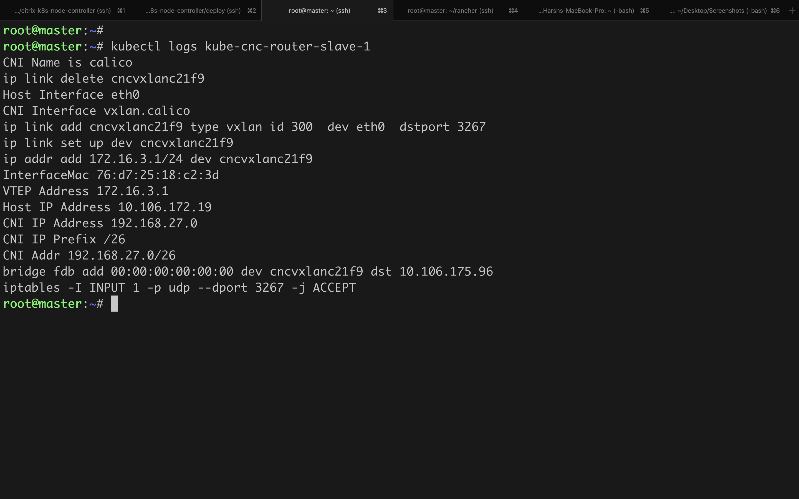

# Troubleshoot Guide

Quick help Guide for some of the common issues that may arise.

### Service status DOWN

We can verify few things to debug the issue of services being in DOWN state.

1. Verify logs of CNC pod using:

   ```
   kubectl logs <cnc-pod> -n <namespace>
   ```

   Look for any "permission" ERRORs in logs. As stated in deployment page, CNC creates "kube-cnc-router" pods    which need NET_ADMIN priviledge to do the configurations on nodes. So, CNC serviceaccount must have 
   NET_ADMIN priviledge and the ability to create HOST mode "kube-cnc-router" pods.

2. Verify logs of kube-cnc-router pod using:

   ```
   kubectl logs <kube-cnc-pod> -n <namespace>
   ```

   Look for any ERROR in node configuration. A typical router pod log would look like:

   

3. Verify kube-cnc-router configmap output using:

   ```
   kubectl get configmaps -n <namespace> kube-cnc-router -o yaml
   ```
   Look for Empty field in the data section of configmap. A typical 2 node data section would 

   

4. Verify Node config
   - CNC interface "cncvxlan<md5_of_namespace>" got created
       - assigned VTEP IP same as the corresponding router gateway entry in ADC
       - status of interface is UP and RUNNING
   - iptable rule port got created.
       - port should be same as that of vxlan created on ADC

   Sample:
   
   

### Service status UP but ping from ADC not working

This is the case wherein though services are UP, still user can't do ping from ADC to the service IP. 
One probable reason for this could be the presence of a PBR entry which directs the packets from ADC with SRCIPas NSIP to a default gateway.
As functionally wise, it will not cause any issue, user can ping with SRCIP as ADC VTEP created by CNC. User can use "-s" option to set the SRCIP to SNIP added by CNC on ADC.

Note: If its absolutely required to ping with NSIP itself, then as of now, User need to remove the PBR entry or add new PBR entry for endpoint with higher priority

### Curl to the pod endpoint not working

This is the case wherein though services are UP, still user can't curl to the pod endpoint.
One Probable reason for this could be the ns mode "MBF" set to enable. This issue depends upon deployments andmight occur only on certain versions of ADC.

To resolve this either:
- Disable MBF ns mode
or
- Bind a netprofile with netprofile Disabled to the servicegroup

Note: As of now, if disabling MBF resolves the issue, then it need to be kept disabled.

## Customer Support

As general support, while raising issue please provide following for faster debugging.

Do a curl/ping from ADC to endpoint and do some captures.

For node:

1. tcpdump capture on CNC interface on nodes
   ```
   tcpdump -i cncvxlan<hash_of_namesapce> -w cncvxlan.pcap
   ```
2. tcpdump capture on node Mgmt interface lets say "eth0"
   ```
   tcpdump -i eth0 -w mgmt.pcap
   ```
3. tcpdump capture on CNI interface lets say "vxlan.calico"
   ```
   tcpdump -i vxlan.calic -w cni.pcap
   ```
4. output of "ifconfig -a" on the node.
5. output of "iptables -L" on the node.


For ADC:
1. show ip
2. show vxlan <vxlan_id>
3. show route
4. show arp
5. show bridgetable
6. show ns pbrs
7. show ns bridgetable
8. Try and capture nstrace while ping/curl:
   ```
   start nstrace -size 0 -mode rx new_rx txb tx -capsslkeys enABLED
   ```
   ```
   stop nstrace
   ```


