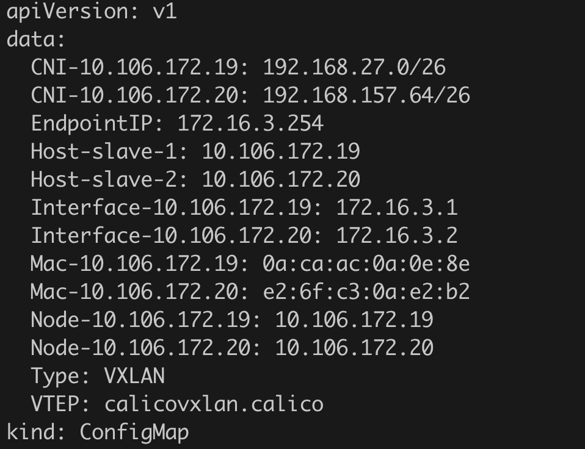

# CNC troubleshooting

This document explains how to troubleshoot issues that you may encounter while using the Citrix Kubernetes node controller (CNC). Using this document, you can collect logs to determine the causes and apply workarounds for some of the common issues related to the configuration of the CNC

To validate Citrix ADC and the basic node configurations, refer to the image on the [deployment](README.md) page.

### Service status DOWN

To debug the issues when the service is in down state,

1. Verify the logs of the CNC pod using the following command::

   ```
   kubectl logs <cnc-pod> -n <namespace>
   ```

   Check for any 'permission' errors in the logs. CNC creates kube-cnc-router pods which require                 NET_ADMIN privilege to perform the configurations on nodes. So, the CNC service account must have the         NET_ADMIN privilege and the ability to create host mode kube-cnc-routerpods.

2. Verify the logs of the kube-cnc-router pod using the following command:

   ```
   kubectl logs <kube-cnc-pod> -n <namespace>
   ```

   Check for any error in the node configuration. The following is a sample typical router pod log:

   

3. Verify the kube-cnc-router configmap output using the following command:

   ```
   kubectl get configmaps -n <namespace> kube-cnc-router -o yaml
   ```
   Check for empty field in the data section of the configmap. The following is a sample typical two node        data section:

   

4. Verify the node configuration and make sure the following:
   - CNC interface cncvxlan<md5_of_namespace> should be created.
       - Assigned VTEP IP address should be the same as the corresponding router gateway entry in Citrix ADC.
       - Status of interface should be functioning.
   - iptable rule port should be created.
       - Port should be the same that of VXLAN created on Citrix ADC.
       
   


### If the service status is up and operational, but the ping from Citrix ADC is not working

If you are not able to ping the service IP address from Citrix ADC even though the services are in operational state. One reason may be the presence of a PBR entry which directs the packets from Citrix ADC with SRCIP as NSIP to the default gateway.

It does not impact any functionality. You can use the VTEP of Citrix ADC as source IP address using the -S option of ping command in the Citrix ADC command line interface. For example:

   ```
   ping <serviceIP> -S <vtepIP>
   ```
Note: If it is necessary to ping with NSIP itself, then, you must remove the PBR entry or add a new PBR entry for the endpoint with high priority.

### cURL to the pod endpoint or VIP is not working

Though, services are in up state, still you cannot cURL to the pod endpoint, that means, the stateful TCP session to the endpoint is failing. One reason may be the ns mode 'MBF' is set to enable. This issue depends upon deployments and might occur only on certain versions of Citrix ADC.
To resolve this issue, you should disable MBF ns mode or bind a netprofilewith the netprofile disabled to the servicegroup.
Note: If disabling the MBF resolves the issue, then it should be kept disabled.

## Customer support

For general support, when you raise issues, provide the following details which help for faster debugging.
cURL or ping from Citrix ADC to the endpoint and get the details for the following:

For the node, provide the details for the following commands:

1. tcpdump capture on CNC interface on nodes
   ```
   tcpdump -i cncvxlan<hash_of_namesapce> -w cncvxlan.pcap
   ```
2. tcpdump capture on node Mgmt interface lets say "eth0"
   ```
   tcpdump -i eth0 -w mgmt.pcap
   ```
3. tcpdump capture on CNI interface lets say "vxlan.calico"
   ```
   tcpdump -i vxlan.calico -w cni.pcap
   ```
4. output of "ifconfig -a" on the node.
5. output of "iptables -L" on the node.


For ADC, provide the details for the following show commands:
1. show ip
2. show vxlan <vxlan_id>
3. show route
4. show arp
5. show bridgetable
6. show ns pbrs
7. show ns bridgetable
8. show ns mode
9. Try and capture nstrace while ping/curl:
   ```
   start nstrace -size 0 -mode rx new_rx txb tx -capsslkeys enABLED
   ```
   ```
   stop nstrace
   ```
